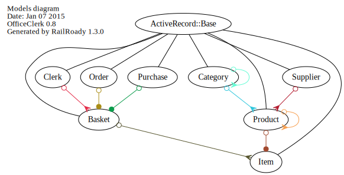

## Models

As any rails app, most functionality is encapsulated as Models, and to be precise that means ActiveRecord::Base derived
classes, which are found in the app/models directory. Below is a brief diagram, just class names and their relations.

Starting at the **Product**, we see that it has one Supplier and one Category. This is using uml speak, not rails, for
rails has_x  belong_to versions see the code. While Supplier is quite standalone, a Category may have another Category
and this means that they form a tree with those Categories as roots that do not have any Category (parent).

By looking at the model we see that Products also form a similar tree, but this is restricted to one level in code.
The association is how Product Lines are implemented, so:

- a Product that has a Product, we call a Product Item
- a Product that has no Product, but is the Parent of other Products, is a Product Line
- and a Product without Product and no Products that have it as a Parent is a (normal) Product

Moving on, we see an **Item** referes to a Product and captures price attribute at creation time. It in turn is used by 
**Basket** which has many Items. A Basket has the ability to be *locked* which happens once stock is transferred.

The idea of the **Basket** is quite central to the design, as it avoids the useless creation of orders. **Orders**, 
**Purchases** and indeed **Clerks** may own a basket for various purposes. But the driving idea was that online customers,
or indeed shop staff, may create baskets and **abandon** them freely.

So the creation of an **Order** (or Purchase) marks a significant event. It should be rare for an Order to remain
incomplete (rather than the norm), also to fulfill laws about invoice numbers. Orders also have a very simple *state* 
model, that is designed to leave freedom in implementation. So after an the order is initially complete, it is 
possible to collect payment and then ship (online store), or ship first and collect payment later (reselling).

A complete diagram with attributes [is here](images/models_complete.svg){:target="_blank"}

[**<- Prev** Architecture](02_architecture.html)    [**Next ->** Searches](04_searches.html)

