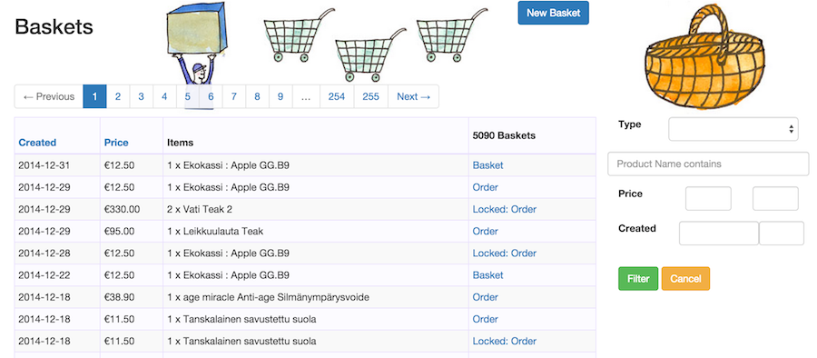
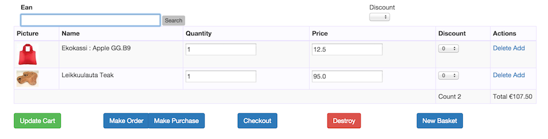

## Baskets

OfficeClerk is built around the idea of a Basket, a shopping basket as it were. But baskets are not just used for shopping,
also Orders, Purchases and possibly in the future wishlists. The distinction is made so that baskets may be produced
(eg by online customers) without creating orders.

A basket represents a list of products at a certain time. It's only other property is that it may be **locked**. We will 
cover in the Order and Purchase chapters when baskets are locked. The sub-chapter below explains a basket contents in
details.

From the list view for baskets you can see the states of a Basket from the last column:

- Basket means that the basket has been created, but is not used anywhere. it may be edited or destroyed
- Order meas that the basket is used by an order and may still be edited (and destroyed by destroying the order).
- Purchase means the basket is used by a purchase and may still be edited(same as above).
- Locked Order/Purchase means the basket is owned by an Order/Purchase and may not be edited anymore.

The list view also contains the products in the baskets and the list may be searched by that.

## Point of Sale

From an administration view, editing baskets is one of the most frequent actions. The screen is therefore streamlined
and may efficiently be used as a Point of Sale (POS) screen.

The ean entry field has the focus immediately (no clicking needed) and may be used to add a product by ean or name.
If the name search does not result in a unique hit, a product list is shown to allow further search refinement. 
When a barcode scanner is used with either ean or self-printed codes, the search finds a single product and adds it to
the basket with the products price.

Both price and quantity of each product may be adjusted and updated with the update cart button.

The discount shows the difference of the current to the products price in percent. The dropdown allows for immediate
discounting in 5 percent steps.

The discount on the top right allows for discounting all products at the same time, also in 5% steps.

Finally the delete and add links decrease or increase the items quantity by one for the most common use case.

Items with a quantity of 0 are autmatically removed from the basket.

### Actions

The buttons allow for different actions, and their presence depends on the state of the basket. 

#### Update cart

As mentioned, this needs to be pressed to make the changes of the text-fields permanent.

#### Make Order / Purchase

These are only present if the Basket was created by a "New Basket" or by the shop system. There is no Order or 
Purchase associated yet and you are free to create either.

#### Checkout

This is meant for use in a Point of Sale context and creates an Order with no shipping cost and external payment.
It also goes to the receipt printing page if PrintClerk is installed and configured for receipts. Receipts print
on page view, thus creating a one click checkout.

#### Destroy

Destroy is only present for newly created baskets that are not used by an Order or Purchase.

[**<- Prev** Introduction](01_index.html)    [**Next ->** Orders](03_orders.html)