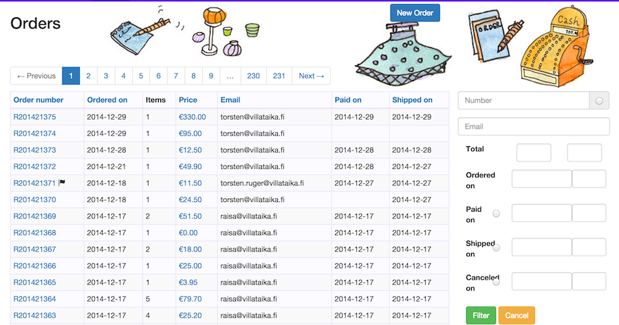
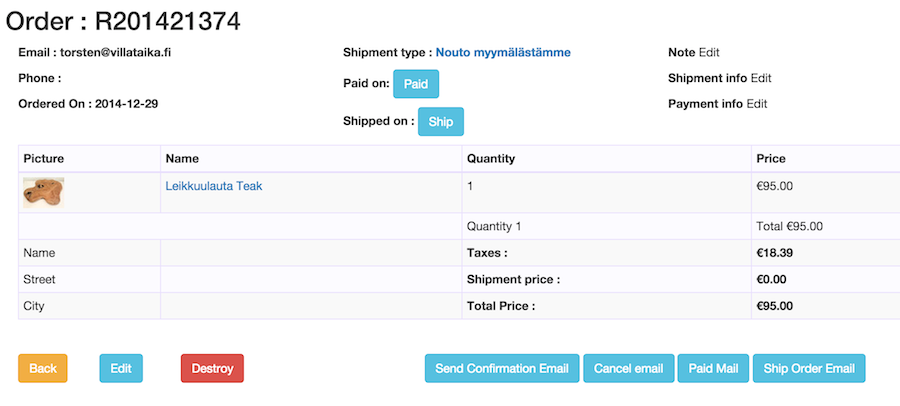

## Orders

An Order captures the transaction of selling products. Products are covered in more detail in a next chapter.
Baskets hold the items that have been sold with price, quantity and tax inforamtion as described in the previous
chapter.

The by now familiar list view shows the main attributes and lets you search for them. Also there is a button to create
a new order in th etop right.

The **Order number** is a running number per year. This is a requirement in many european countries. The format R + year + 
running number may be changed easily by a developer. Clicking on it will show the order and let you edit it. You also see
a little *flag* on one order, which means there is a note attached.

**Ordered on** is the date when the order was created. This can't currenty be changed, as long "open" orders are not the
norm. Remember that headers that are links let you order the list according to that column.

The **Items** just shows how many items have been sold and the **price** shown here is the total price of the order, 
which is the products (of the basket), plus shipment cost. 
Payment does not have an associated cost in Clerks, but that may easily be added by a dedicated product. 

The **email** is usually the customers email, or in POS use the sales persons. (Picture is a test db)

Finally the **Paid on** and **Shipped on** tell you if and when the order has been paid or shipped. More on that below.

The **Search** fields are pretty self explanitory, apart from the radio fields. The top radio at the number lets you
search for orders with notes.

For the date-range searches of Paid on, Shipped on, Canceled on, the radio button means: search for Orders where the 
respective field is not set. So, for example, to find all orders that are not paid, you would klick the radio button
at the Paid on range. This may be combined with other fields, so you could fill out a date range for Ordered on, plus
the Paid on radio, to find orders that have been ordered in that range, but not paid yet. 

### Order creation and states

We have already seen how the Basket edit may be used as a POS screen to create Orders with one click. These orders nevertheless show up in the list and may be searched and viewed. Also you can start an order by creating the basket, and go then create
an order from that. Or you can press the "New Order" on the search screen, which will also let you fill the basket and 
then you go back to the order. For an previously created order the first link, the order number, will also get you here.

Only if you have PrintClerk installed can you print invoices or receipts, otherwise there is no seperate view/edit screen, 
so we'll go through the actions that you can do here and how the view changes. 

The basic contact info, email and phone is at the top, even phone is optional. An optional shipping address is at the bottom
left of the table. You can edit the shipping address and shipment type through the link where it says **shipment type**.
That will lead you to another screen to enter the info lead you back here. Shipment types other than pickup (the one shown, 
in finish though), need to have an extension installed. PostClerk covers the basic postal, weight based service.

Underneath the shipment type we see the **Paid on** and **Shipped on** dates, or as in the picture, the buttons to
set those dates. The Shipped On will usually be pressed by the person organising the shipment, but Payment may happen in
several ways. The POS checkout process will set the date to the checkout date and asume payment is collected by the person.
Also Orders may be created by sales staff from phone or emails, and then an accountant may press the Paid on, when 
payment is received. And an extension may set the field automatically when a credit card payment has been processed by
a customer. While planned, currently such an extension does not exist.

On the right we see three edit possibilities, that allow for in-line editing. When data is entered it will obvioulsly be 
shown there.

The **Note** is a completely internal text that may be used for several purposes. Primarily we have used it as a sort of to-do
or reminder, like "call again in 2 weeks" or "payment plan agreed...". It may also be used as a way to communicate for 
different staff handling the order, eg a sales person may write "send free flyers" etc. As mentioned above, the notes presence
is shown in the list and there is a possibility to search for orders with notes.

The **Shipment info** is usually a tracking code of some kind and may be filled by the person handling the shipment. The 
standard *ship order email* will mention this code, if present.

**Payment info** is not currently used but meant to serve a similar purpose to the shipment info. Extensions may use this to
store a transaction number.

The summary of the **basket table** should be quite clear after the [previous chapter](02_baskets.html). 

The **edit** but, when present, will allow the basket to be edited. 
This is possible until the order is shipped, in other words the Ship button is pressed.

The **destroy** button will delete the order and it's basket completely. This is only possible if the order has been neiter
paid, nor shipped. 

The **email buttons** let you send email for the various steps. Depending on your usage you will want to change the texts.
The OfficeClerk send no automatic emails, but the SalesClerk will send a confirmation mail when the order has been placed.
The email server has to be configured by standard rails mechanisms, wich include sender address and possibly a default bcc.

[**<- Prev** Baskets](02_baskets.html)    [**Next ->** Purchases](04_purchases.html)

