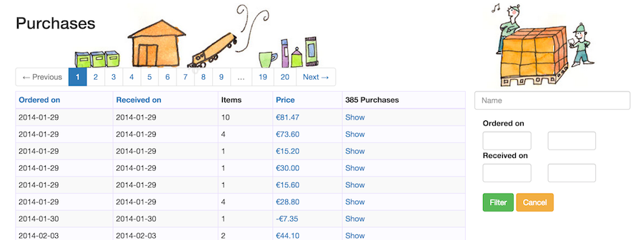
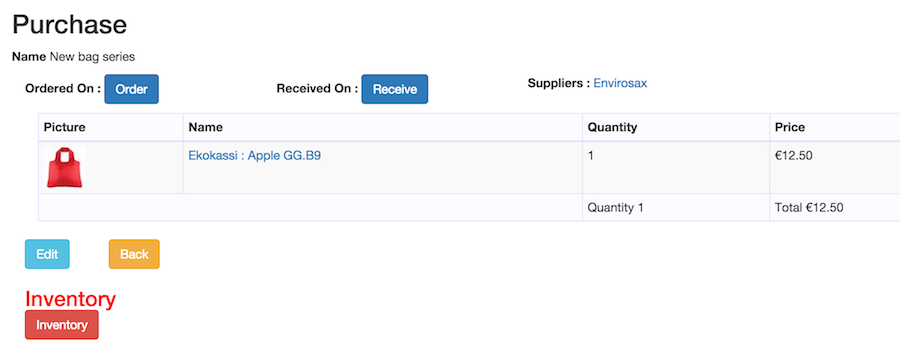

## Purchases

When you purchase, you bring inventory into the system. Or, the other way around, to bring inventory into the system
you need to receive a purchase. There is no direct way to manipulate the inventory, so you can always track changes.

The list of purchases is a thin layer on top of the basket, the product list, of what you're buying.

For a buyers workflow this means it is best to create the products you plan to buy, before actually making your order
(here purchase) to buy them.

Update: the screenshot is slightly out of date as now purchases have an "new" button and also the first column is the name,
after which you can search (see search box up right)

Purchases are quite like Orders in that you can create one by use of the "new" button, or by creating a basket and then
creating a purchase from there. Either way, you will end up on the screen above.

The **name** is inline editable and serves as a reminder for you what this Purchase was about. It is not shown externally, but
may help to communicate internally.

The **Ordered on** and **Received on** will show the respective dates of when the buttons were pressed.

Ordered on is mostly for internal purposes and will let eg fullfilment staff know that items have been ordered.
It will also let you estimate purchase lead-time if you do purchases per supplier.
It is not neccessary to use this feature as receiving will set the date as well.

**Received on** marks the physical receiving of the items and pressing the button will create the inventory in the system.
After the purchase has been received the basket may not be edited any more.

On the right there is a list of suppliers for the products in this purchase, just for information.

Below the Basket table there is the back (to the list) button and if the purchase has not been received also an edit
button, to edit the basket.

**Receiving** will change the product prices of the baset to **cost prices**. Cost may be used to determine profit and for
reporting generally.

#### Inventory

As every shopkeeper knows it does not matter how well you keep track of your inventory, at some point reality and the system
numbers will differ. Even without this becoming obvious, most shops will do at least a yearly inventory to check that what 
is, is what should be.

The **Inventory** button is in red for the good reason that if used wrongly it may easily cause havok in your system. The button
works as you might expect, by taking the quantities of your list (basket) and transferring them to your stock.

It is **essentail** to have counted all items of the products in the list.

As the result the purchase will hold the differences that were applied to achieve the desired result. So the action is
 **destructive** as the list will not show the counts anymore afterwards. Only the products will show the inventory.

[**<- Prev** Orders](03_orders.html)    [**Next ->** Products](05_products.html)
