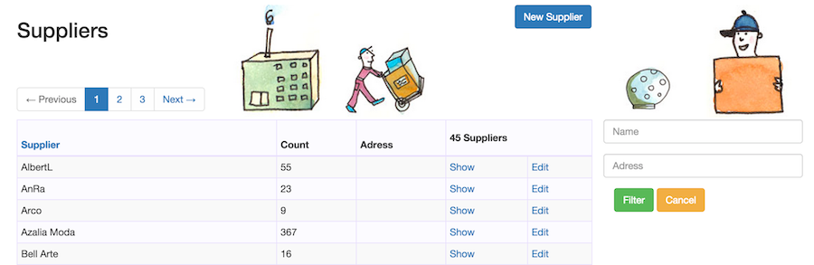

## Suppliers

While customers buy from you, you buy from your suppliers. Each product must may associated with a supplier and from this
Purchase orders may be prefilled in the future.

Currently the supplier is very simple and mostly it's name matters. It helps to use them also for reporting purposes.

The list view shows the same kind of basic layout as for the products, alas there is only really the name to search by.
The *count* column shows the number of products that have this suppplier associated with them. 
Also the page to view a supplier will list all products of that supplier.

Suppliers may not be deleted currently. Though without products this would theoretically be possible. 
Currenly we suggest to reuse such a case if a new should be created, ie edit it.

[Prev: Product Lines](06_product_lines.html)        [Next: Categories](08_categories.html)    
