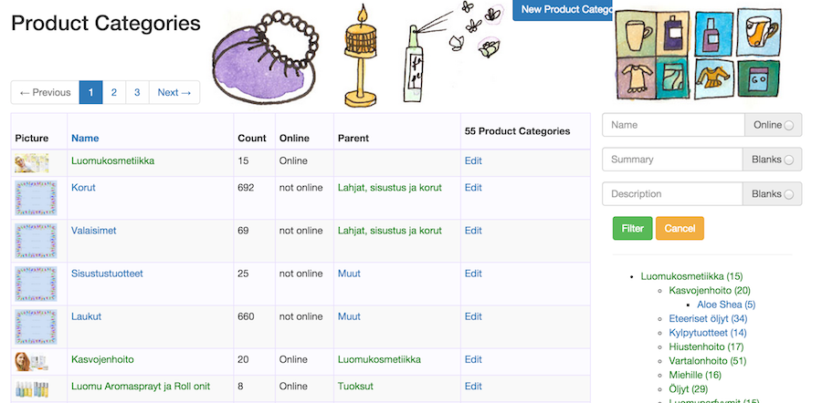

## Categories

Categories are a way to group and organie products. The basic web-shop shows products by Category.

A Product may be in exactly *one* Category.

Each Category may be in exactly *one* Category, we call that category it's parent.

The list view shows the same kind of basic layout again and we see from the search fields what the data is.
The **name**, **summary** and **description** are very much like the Product. Also the **online** property is
the same, and off course all of these may be edited in the edit screen.

Again the count is the number of products in this category, and also the detailed view of the category lists the 
products.

Below the search we see a tree view of all categories. Notice how the gree marks the category to be online and 
both online and non-online categories may be included in online categories. In the same way a category may include
products that are online or not. Obviously only the online ones (both products or categories) will be shown in the
online shop.

Also the category may contain both products and sub-categories. How or if you use this is up to you, we usually
have either categories or products, or if both then only non-online ones of one.

When, while editing a category, one changes it's online status, products of that category are also made online.
This is meant to help bring larger numbers of products online quickly and save work. But one must be aware not to
inadvertantly make products online that way.

[Prev: Suppliers](07_suppliers.html)        [Next: Shop](11_shop.html)    
