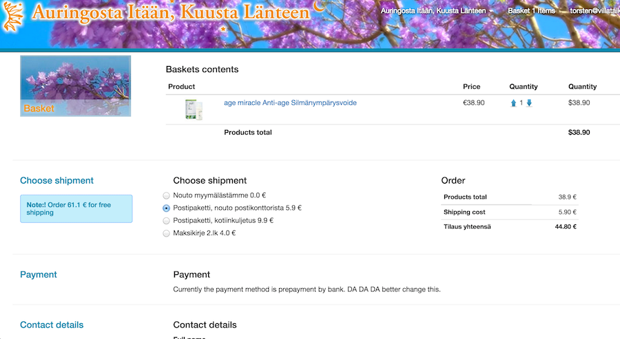
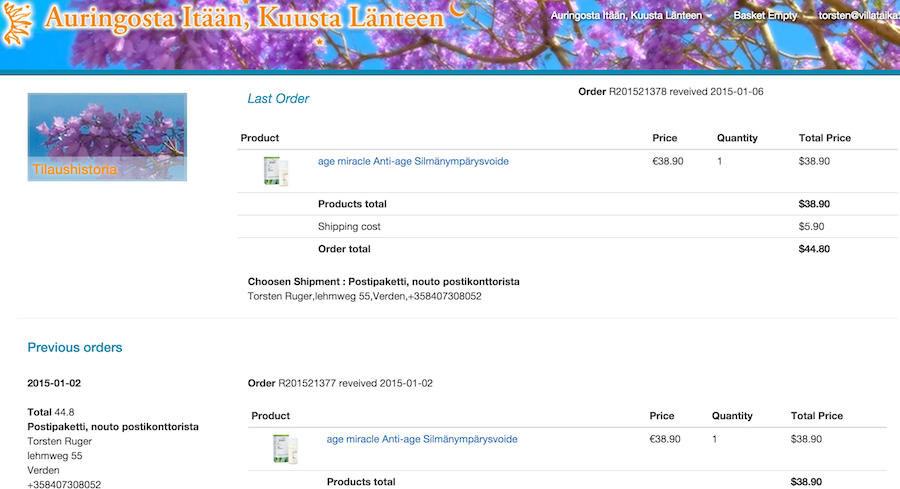

## Online shop

Remember this is our shop, it is just an example of your **starting point**.

The design is what we arrived at after some months and is not meant as a zero work drop in, 
rather a good start to develop your own ideas Probably the code is more helpful than the actual style.

The style we chose is quite large on pictures and big boxes, little text. On the other hand quite low on js and 
modern "eye candy" (transition/effects/autofills etc)

Below are screenshots of the main pages:

- The main page shows the main (root) categories in extra large format
- A normal group with groups will show smaller pictures (also with overlay name) and a vertival breadcrumb on the left
- A group with products will show those with the breadcrumb. Actually the two anre the same template and if both sub-groups and products are present the sub-groups are shown first
- A quite normal product page shows also related/same category products
- The shopping basket is the checkout page in one page. Sipping method updates the total per js and contact details are below. Payment currently external.
- There is an order confimation (not show) which is quite similar to the order history (shown).

Smaller log in/sign up are not shown and the navbar menu contains a few static pages.

## Main Page

## Sub Group with groups

## Group with products

## Product page

## Basket page is checkout page

##History

[**<- Prev** Categories](08_categories.html)
