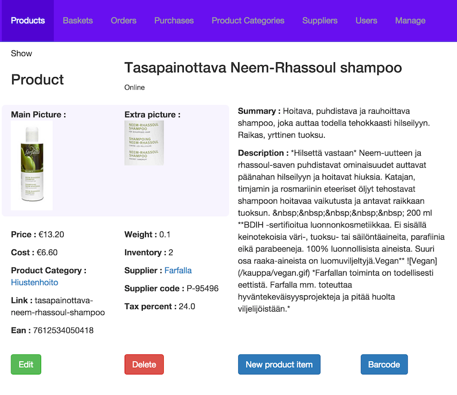
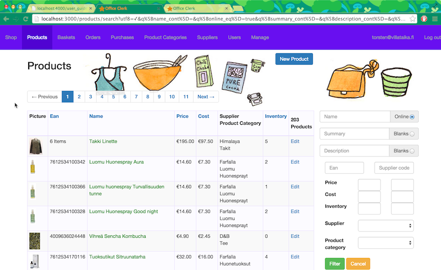

## Products

Lets start with an edit page, to see what a product is made of:

So we see from the bottom left that we can edit this, and the edit page is quite similar, except off course editable.
Actually some of the more simple attributes are also editable in place (try clicking).

Also we see a delete button, but you cannot delete products with inventory. Also products are never really deleted, we just 
mark them as deleted. We will come to the other buttons later.

If we look at the attributes  in order:

The **price** is what you sell for, ie the price you show in shopping baskets, orders and invoices. 
It includes tax (or vat) , see to the right below.

The **cost** is what you buy for. This is really only for your own reporting. By calculating the difference you can 
get reports about profit too.

The **Category** is one of a hierachy of categories, used to make products in a shop browsable (see [Shop](shop.html))

The **link** is where the product will be shown in a shop (ususally /prod/link). It is usually autogenerated 
from the name when the product is created. Care must be taken when changing it in a live system, as search engines 
will not like that.

The **ean** is an often globally unique number identifying the product. They are usually encoded as barcodes on packages 
and may be scanned in with a barcode scanner. Alternatively you can just make up your own. They usually end up on 
invoices, sometimes in order confirmations (though not in sales_clerk). See [PrintClerk](print_clerk.html) for more. 

The **weight** is used for shipping cost calculation, especially by PostClerk. If you use a different shipping module you 
might not even need this, or use it in a different way.

**Inventory** shows how many items you have in stock. The chapter on [Orders](orders.html) provides more detail on inventory.
It is the only attribute thet may not be edited as only ordering and purchacing changes it.

The **supplier** is one of a list that you configure and you must add one to be able to add stock, by buying from that Supplier.

The **supplier code** is the code the supplier gives to the product. You may not use it or use it as a secondary internal
 id (like a shelf location).

The **tax** is a percentage (ie 0-100) of tax that is included in the price. Beware though that the percentage is taken from 
the 0% price and added, so it is not the percentage of the price show. See below for details.

The **name** is the title of the page and also what show up on order confirmations and bills and in the net. It should be 
descriptive, while not too long.

The **summary** is just that, we use it in the shop for list views. As such it has a fixed limit of characters that show.

The **description** is describes the product in details and may contain formatting via markdown.

The **online** property shown right under the name determines whether the product will be visible in the online shop.

#### Tax calculation

A little more about european taxes: End user prices are *always* inclusive of the tax, but the tax has to be made explicit on
bills or order confimations.

Taxes differ per country and per product range and over time. For example the current "standard" rate in Finnland is 24%, but 
it used to be 22% about 5 years ago, and in Germany it is 19%. Other categories are accommodation (14%), food (10%), tickets (0%) etc. This is why the tax is stored in the product.

Tax is added to a tax-exclusive tax (which is not usually shown anywhere), so for a standard product that would cost 100 Euros,
the end user pays 124 euros, because the 24% are added.

The important thing to remember is that the tax is **not 24% of 124** , which would be 29.76, **but 24**, so 24% of 100.

#### Product Lines

There is an extra button in the bottom right called New product item. This will create a product line from the current product
and add a first Product Item to this line. Product items may be know as Variants to users of other systems.
Product Lines and Items are their own topic, explained in the [next chapter](product_lines.html)

### Search and list view

This lets you see and search the products you have. The list view below is quite straight forward and contains most of the 
attributes discussed above. When a header is a link, it may be used to sort according to that attribute.

The box on the right lets you filter the products, and is currently showing only *online* products. Name, Summary and 
description fields let you search for words *contained* in those fields. The Blanks radio let you search for products
with no summary or description (especially interesting in conjunction with the online !). All search properties may be 
combined and that means *all* properties have to be met (not just any).

The ean and supplier code let you similarly search for the respective attributes. These too are *contains* searches, so if 
you use some pre-or postfix system for supplier codes, you may get subsets by searching for those pre/postfixes, not just 
single hits as you would by using an ean. The form may be used with a barscanner in the ean field, which may be set up to 
provide a carrige return, ie submit the form.

The price, cost and inventory ranges are straightforward, which leaves Supplier and Categories. These let you search for 
products of exactly one Supplier or category.

The pagination links at the top (are actually repeated out of view at the botton), let you skip through the pages and as
they are links work in seperate tabs too.

Finally the Cancel button will cancel the current search and basically act like the Products menu item, returning you to the
unfiltered list.

[Prev: Introduction](index.html)    [Next: Product Lines](product_lines.html)